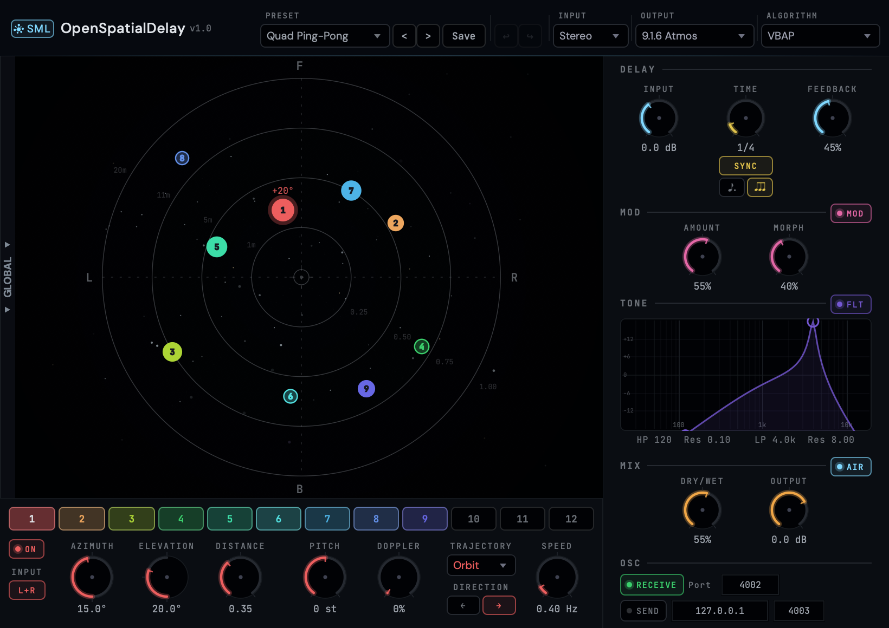

<p align="center">
  
</p>

<h1 align="center">OpenSpatialDelay</h1>

<p align="center">
  <strong>A spatial delay effect where each echo lives in 3D space.</strong><br>
  VST3 &middot; AU &middot; macOS &middot; Windows
</p>

<p align="center">
  <a href="https://github.com/Spatial-Media-Lab/OpenSpatialDelay/releases">Download</a> &middot;
  <a href="https://spatialmedialab.org">Spatial Media Lab</a> &middot;
  <a href="docs/OpenSpatialDelay_Manual_v1.0.pdf">User Manual</a>
</p>

---

<p align="center">
  
</p>

## What is it?

OpenSpatialDelay is a spatial delay plugin. Think of a classic stereo ping-pong delay — but instead of bouncing between left and right, the echoes travel through up to **12 positions in 3D space**.

Each tap reads from a shared delay line at sequential intervals. Every tap has its own position (azimuth, elevation, distance), pitch shift, Doppler amount, trajectory animation, and input channel selection. The output is rendered through one of five rendering paths — from binaural [HRTF](https://en.wikipedia.org/wiki/Head-related_transfer_function) convolution for headphones to discrete surround speaker panning for Dolby Atmos stages.

OpenSpatialDelay is the first plugin in the **Spatial Media Library** — an open-source suite of spatial audio tools by [Spatial Media Lab](https://spatialmedialab.org), a community dedicated to making immersive 3D media accessible to creators everywhere.

## Features

**Spatial Engine**
- 12 independent delay taps, each positioned anywhere in 3D space
- 7 spatialization algorithms (Ambisonics, ConstantPower, DBAP, KNN, MDAP, VBAP, VBIP) — each works for surround, binaural (via virtual speaker layout), and Ambisonics output
- 6 binauralization options: 5 measured HRTF profiles from [SOFA](https://www.sofaconventions.org/) files (MIT KEMAR, SADIE D2-KU100, CIPIC 003, HUTUBS PP2, Bernschuetz KU100) + 1 CPU-lite option "Simple (Low CPU)" — Woodworth ITD+ILD approximation, not an HRTF
- 23 output formats — Binaural, Stereo (5 mic simulation modes), 15 Surround (Quad through 9.1.6 Atmos + SpatialMediaLab 13.1), 6 Ambisonics (1st through 6th order)

**Delay & Modulation**
- Tempo-synced or free-running delay with per-tap pitch shift, layered on top of a global tap-pitch offset
- Per-tap pitch shift (±12 semitones) that preserves timing via phase-vocoder STFT
- Wobble modulation — delay-time LFO with morphable waveform (sine → square)
- Stereo input routing with per-tap L/R channel selection
- Feedback filters (low-pass + high-pass with resonance), soft clipper, output limiter

**Animation & Control**
- 13 trajectory shapes per tap — Orbit, Figure-8, Spiral, Heart, Helix, Bounce, and more (plus "None" to keep a tap static)
- Forward/reverse trajectory direction
- [ADM-OSC](https://adm-osc.music.columbia.edu/) receive and send for external position control, plus full OSC control of all parameters via custom `/osd/` namespace
- Doppler effect with distance-based air absorption

**Workflow**
- 70 factory presets across 8 curated categories, plus a User category for your own saves
- Save / load your own presets, including custom categories, from the plugin header
- Spatial map with real-time trajectory visualization
- Global tap controls — 6 offset knobs that adjust all enabled taps simultaneously, preserving spatial arrangements

## Installation

### Download (recommended)

Grab the latest release from the [Releases page](https://github.com/Spatial-Media-Lab/OpenSpatialDelay/releases).

- **macOS:** Download the ZIP, extract it, then copy the `.component` file to `~/Library/Audio/Plug-Ins/Components/` (AU) and the `.vst3` bundle to `~/Library/Audio/Plug-Ins/VST3/` (VST3). Then remove the macOS quarantine flag — see [macOS security note](#macos-security-note-gatekeeper--sequoia) below.
- **Windows:** Download the VST3 plugin and copy it to `C:\Program Files\Common Files\VST3\`.

### Build from source

Requires CMake 3.22+, a C++17 compiler, and zlib.

```bash
git clone --recursive https://github.com/Spatial-Media-Lab/OpenSpatialDelay.git
cd OpenSpatialDelay
cmake -B build -DCMAKE_BUILD_TYPE=Release
cmake --build build --config Release
```

On macOS, the post-build script automatically copies the AU and VST3 plugins to `~/Library/Audio/Plug-Ins/`. Factory presets are installed to `~/Library/Audio/Presets/OpenSpatialDelay/`.

**Dependencies** (handled automatically):
- [JUCE 8](https://juce.com/) (git submodule)
- [libmysofa](https://github.com/hoene/libmysofa) v1.3.2 (CMake FetchContent)
- zlib (system on macOS, [vcpkg](https://vcpkg.io/) on Windows)

### macOS security note (Gatekeeper / Sequoia)

OpenSpatialDelay is not yet notarized with Apple. macOS will block the plugin on first launch with a "cannot be verified" warning. To fix this, open Terminal and run:

```bash
xattr -cr ~/Library/Audio/Plug-Ins/VST3/OpenSpatialDelay*.vst3
xattr -cr ~/Library/Audio/Plug-Ins/Components/OpenSpatialDelay*.component
```

Then restart your DAW. You only need to do this once per download.

## Quick start

1. Load OpenSpatialDelay on a track in your DAW
2. Set the output format to match your monitoring setup (Binaural for headphones)
3. Play audio — you'll hear 4 taps spread across the spatial field
4. Drag taps on the spatial map to reposition them in 3D space
5. Enable more taps, add trajectories, and experiment with pitch and feedback

See the [User Manual](docs/OpenSpatialDelay_Manual_v1.0.pdf) for the full guide.

## System requirements

| | Minimum |
|---|---|
| **macOS** | Apple Silicon (arm64), macOS 12+ |
| **Windows** | x64, Windows 10+ |
| **Formats** | VST3, AU (macOS only) |
| **DAWs** | Tested: REAPER. Should work with any VST3/AU host (Logic Pro, Ableton Live, Cubase, Bitwig, and others) |

## Documentation

- [Quick Start Guide (PDF)](docs/OpenSpatialDelay_Manual_v1.0.pdf) — install, load, and start using the plugin
- [Full Documentation](https://wiki.spatialmedialab.org) — complete reference on the Spatial Media Lab wiki
- [Version History](docs/VERSION_HISTORY.md) — changelog across all versions

## Contributing

OpenSpatialDelay is open source and contributions are welcome. If you'd like to contribute:

1. Fork the repository
2. Create a feature branch
3. Submit a pull request

For bug reports and feature requests, please [open an issue](https://github.com/Spatial-Media-Lab/OpenSpatialDelay/issues).

## License

OpenSpatialDelay is free software, licensed under the
**[GNU General Public License v3.0 (GPL-3.0)](LICENSE)**.

HRTF data from third-party sources under their respective licenses (MIT, Apache 2.0, CC BY, Public Domain). See [HRTF/](HRTF/) for details.

## Credits

**Andrew Rahman** — Product Vision & Design
**Claude** — Technical Architecture (Anthropic)

Part of the **Spatial Media Library** by [Spatial Media Lab](https://spatialmedialab.org).

<p align="center">
  <sub>Making spatial media easy to create, open to explore, and greater to enjoy.</sub>
</p>
